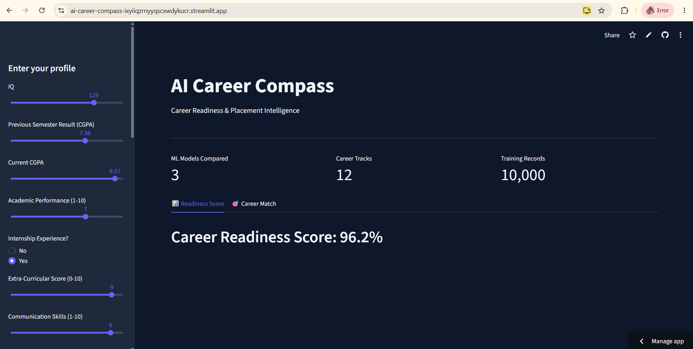
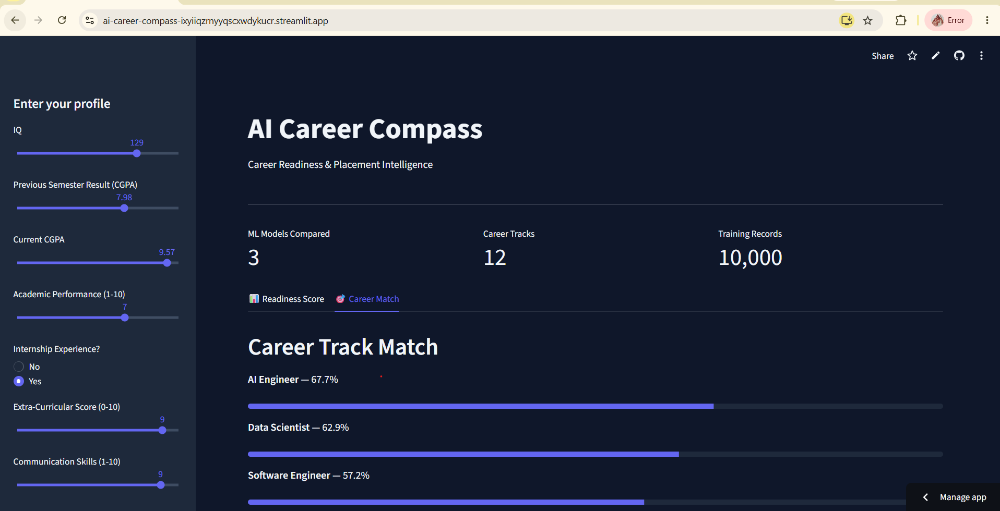

# 🧭 AI Career Compass

**Live app:** https://ai-career-compass-ixyiiqzrnyyqscxwdykucr.streamlit.app/

An ML-powered career readiness platform. Enter your academic and skill profile, and get:
- A **Career Readiness Score** — placement probability from a Random Forest model, with an honesty check that flags predictions made on unusual/out-of-range inputs
- A **12-track Career Match** — a transparent, rule-based engine scoring your fit against AI Engineer, Data Scientist, Web Developer, DevOps Engineer, and 8 other tracks
- An **AI-generated Roadmap** — Google Gemini generates a personalized, month-by-month plan to close your specific skill gaps




## Tech Stack
- **ML:** scikit-learn (Random Forest, tuned via GridSearchCV), pandas, joblib
- **App:** Streamlit
- **AI roadmap generation:** Google Gemini API (`gemini-flash-latest`)

## How it works
1. **Placement model** — trained on a [10,000-row student placement dataset](https://www.kaggle.com/datasets/sahilislam007/college-student-placement-factors-dataset). Compared Logistic Regression, Random Forest, and XGBoost; selected and tuned Random Forest.
2. **Career matching** — a hand-authored weight matrix (`career_weights.py`) scores 16 input skills against 12 career tracks. No ML model here by design — it's fully transparent and explainable.
3. **Roadmap generation** — the top-matched track's missing skills are sent to Gemini, which generates specific topics and a project idea per skill.

## An honest note on the dataset
During EDA, the placement model hit 100% test accuracy — usually a red flag. I investigated using a shallow decision tree and confirmed the dataset was generated from clean threshold rules (e.g. `CGPA > 8.01 AND Communication > 7.5`), not noisy real-world outcomes. This means the model is reliable *within* the patterns this dataset represents, but may be overconfident on genuinely unusual profiles — which is why the app includes an out-of-range warning system rather than presenting every score as certain.

## Run locally
```bash
git clone https://github.com/Poojarautela03/ai-career-compass.git
cd ai-career-compass
pip install -r requirements.txt
# add your own Gemini API key to .streamlit/secrets.toml:
# GEMINI_API_KEY = "your-key-here"
streamlit run app.py
```

## About
Built by Pooja Rautela — [LinkedIn](https://linkedin.com/in/pooja-rautela-980999262) · [GitHub](https://github.com/Poojarautela03)
